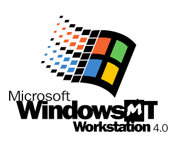

<p align="center">
  
</p>

<p align="center">
  <strong>MatanelOS</strong><br>
  An x86-64 operating system built from scratch, with a strong Windows NT architectural influence.
</p>

<p align="center">
  <a href="https://github.com/slep2-0/MyOS/blob/master/LICENSE"></a>
  
  
  
</p>

> MatanelOS is an independent educational project. It is not affiliated with or endorsed by Microsoft. The image above represents the project's Windows NT inspiration, not ownership of the Windows name or artwork.

MatanelOS began as a small experiment in getting a kernel to boot. It is not small anymore.

Today the project crosses the complete boundary from firmware to user mode: a UEFI bootloader loads the kernel, the kernel brings up multiple processors and its executive subsystems, MTDLL provides the native user-mode runtime, and MTE executables can use processes, threads, synchronization, exceptions, heaps, DLL loading and static TLS.

The implementation is written to learn the difficult parts directly. That means page tables, scheduler state, wait races, APC delivery, object lifetime, image relocation and exception continuation are project code, not services borrowed from a host operating system.

## Current State

This branch represents a major rewrite compared with the previous `master` snapshot. The most important working areas are:

### Platform and kernel core

- x86-64 UEFI boot with a custom bootloader and GOP framebuffer console.
- ACPI discovery, Local APIC initialization, timer interrupts and SMP startup.
- Preemptive per-CPU scheduling, context switching, IRQLs, software interrupts, IPIs, DPCs and APCs.
- Explicit switched-away kernel-stack ownership and deliberate migration of READY threads between processor queues.
- Spin locks, blocking push locks and interlocked primitives used across SMP paths.
- Fatal bugchecks with processor, thread, CR3, IRQL and stack diagnostics.

### Memory management

- Physical page tracking through a PFN database and bitmap-backed allocators.
- Kernel paged and nonpaged pools.
- Per-process address spaces, VAD tracking and user virtual-memory allocation, protection and release.
- Demand page-fault handling, copy-on-write support and TLB invalidation/shootdown paths.
- Section objects with cross-process view mapping and unmapping.

### Processes, threads and objects

- Kernel object types, reference counting, handles, access masks and client IDs.
- Process and thread creation, termination, waiting, exit-status queries and process parameters.
- User-mode `CreateProcess` with image path, command line, current directory, inherited environment and returned process/thread handles.
- Suspend and resume through APC delivery and a private semaphore, including nested suspend counts and termination rundown.
- Waitable events, mutexes, semaphores, threads and processes.
- Mutex recursion, ownership tracking, direct handoff and abandonment when an owner dies.
- Timeout versus signal races resolved through a single claimed wait result.

### User mode and MTDLL

- A native `Mt*` syscall ABI plus a higher-level public MatanelOS API.
- MTDLL process/thread startup, per-thread TEB state and per-process PEB/loader state.
- A user heap with slab allocation for small blocks, segment allocation for larger blocks, reallocation, size queries, locking and destruction.
- Frame-based user exception handling, `RaiseException`, validated context continuation and a build-time `__try`/`__except` translator.
- MTDLL loader support for `LoadLibrary`, `GetProcAddress` and `FreeLibrary`.
- Dependency reference tracking, attach/detach entry points and failed-load rollback.
- Static TLS for executables and DLLs, including per-module templates, per-thread blocks and loader-assigned module indices.

### Storage and executable images

- AHCI-backed block I/O.
- A VFS layer with a FAT32 implementation for the system volume.
- A custom MTE image format for executables and shared libraries.
- Generated imports and exports, image-relative relocations, rebasing and packed TLS metadata.
- ELF is used only as the LLVM linker intermediate; the running image is MTE.

## Architecture at a Glance

```text
UEFI firmware
    |
    v
BOOTX64.EFI
    |  memory map, framebuffer, ACPI and storage discovery
    v
MatanelOS kernel
    |  MM, object manager, scheduler, synchronization, VFS, native syscalls
    v
MTDLL
    |  process/thread startup, heap, loader, exceptions, TLS, public API
    v
MTE executable and DLL images
```

The naming and layering deliberately resemble parts of NT because that architecture is one of the main subjects being studied. MatanelOS is not a Windows reimplementation, and its ABI is still free to evolve while the design matures.

## Building on Windows

The supported build environment is native Windows. Visual Studio is the IDE and front end; LLVM/Clang, LLD and NASM produce the freestanding x86-64 ELF intermediates expected by the current toolchain. Python packages the final MTE images and creates the bootable FAT32 disk image.

### Requirements

- Windows 10 or newer.
- Python 3 with the `py` launcher.
- LLVM and NASM. The setup script can install them through `winget`.
- Visual Studio with C/C++ project support is optional, but recommended for IDE use.
- QEMU and OVMF for local execution. They are optional if only compilation is needed.

Run the one-time prerequisite setup from a normal Command Prompt:

```bat
tools\windows\bootstrap.bat
```

This checks or installs LLVM, NASM and the Python FAT32 image dependency. Environment overrides for nonstandard installations are documented in [`tools/windows/README.md`](tools/windows/README.md).

### Command-line build

Build the complete Debug image:

```bat
build_windows.bat Debug
```

Build an optimized image:

```bat
build_windows.bat Release
```

The final bootable image is written to:

```text
build\windows\debug\matanelos.img
```

or the corresponding `release` directory.

### Visual Studio

Open `KernelDevelopment.sln`, choose `Debug|x64` or `Release|x64`, and build the solution normally. The project invokes the same deterministic Windows build driver used by the batch scripts, so command-line and IDE builds produce the same artifacts.

### Run in QEMU

```bat
run_windows.bat Debug --cpus 4
```

For a uniprocessor run:

```bat
run_windows.bat Debug --cpus 1
```

The default run boots the normal kernel and starts the current user-mode program. QEMU and OVMF can be redirected with `QEMU_BIN` and `MATANELOS_OVMF` when they are not installed in an automatically detected location.

## Verification

The repository contains headless QEMU gates instead of relying only on seeing a successful boot screen. Current focused gates cover:

- event, timeout, semaphore and mutex semantics under SMP contention;
- thread/process waiting, object lifetime and handle closure;
- suspend, resume, APC delivery and termination races;
- user exception registration, dispatch, continuation and malformed chains;
- heap allocation and reclamation;
- DLL load/unload, imports, relocations and dependency references;
- executable/DLL static TLS and per-thread isolation;
- user-mode process creation, argument parsing and environment inheritance.

Examples:

```bat
py -3 tools\windows\stress_heap.py --configuration Debug --cpus 1,4
py -3 tools\windows\stress_loader.py --configuration Debug --cpus 1,4
py -3 tools\windows\stress_tls.py --configuration Debug --cpus 1,4
py -3 tools\windows\stress_exception_chain.py --configuration Debug --cpus 1,4
py -3 tools\windows\stress_process.py --configuration Debug --cpus 1,4
```

These are development gates, not a claim that the OS is production-ready. Hardware support is intentionally narrow, many interfaces are still unstable, and QEMU remains the primary qualification environment.

## Repository Layout

| Path | Purpose |
| --- | --- |
| `boot/` | UEFI loader, runtime support and required EDK2 headers. |
| `kernel/` | Kernel executive, scheduler, memory manager, object manager, drivers and filesystems. |
| `shared/include/` | ABI definitions shared by the kernel, MTDLL and applications. |
| `usermode/programs/dlls/` | MTDLL and future shared libraries. |
| `usermode/programs/exes/` | Normal user-mode applications. |
| `tests/kernel/` | Kernel stress and subsystem test harnesses. |
| `tests/usermode/` | Isolated user-mode runtime test images. |
| `tools/mte/` | MTE packer and image-format verification. |
| `tools/windows/` | Windows build driver, image creation and headless QEMU gates. |

## Branches

- [`master`](https://github.com/slep2-0/MyOS/tree/master) is the public milestone branch. It should move when a coherent feature set is integrated and qualified.
- [`developer`](https://github.com/slep2-0/MyOS/tree/developer) is the active integration branch. It receives the newest work first and may temporarily contain unfinished or changing interfaces.

Keeping both branches is useful. `developer` lets difficult kernel work accumulate without pretending every intermediate commit is a stable release, while `master` gives readers, recruiters and future contributors a coherent snapshot. Small projects can live directly on `master`; this project has crossed the point where that would make its public history harder to trust.

## Development Timeline

Development began on **July 16, 2025 at 3:43 AM**.

This major integration was prepared on **August 20, 2026**, after approximately **400 days of calendar development**. That number is the age of the project, not a fabricated count of active coding hours. The repository history is the better record of how the system grew.

## What Comes Next

The immediate direction after this milestone is scheduler policy: priorities, enforced CPU affinity and automatic load balancing built on the READY-thread migration foundation. Longer-term work includes multiple-object waits, broader filesystem behavior, kernel-mode unwind support, networking, graphics and the user-facing environment needed to make MatanelOS useful beyond a kernel laboratory.

## Why I Am Building It

The point is not to produce another kernel that prints text and stops. I want to understand why mature operating systems have the structures they do, what breaks when two CPUs disagree by one instruction, and how user code safely crosses into and back out of the kernel.

Some of the best progress in this repository came from failures that looked random: corrupted queues, stale wait ownership, stack handoff races, invalid return frames and loader lifetime bugs. Tracking those down changed the design. That is the project I want this repository to show.

Contributions, code review and technically serious criticism are welcome.

## License

MatanelOS is available under the [GNU General Public License v3.0](LICENSE).
